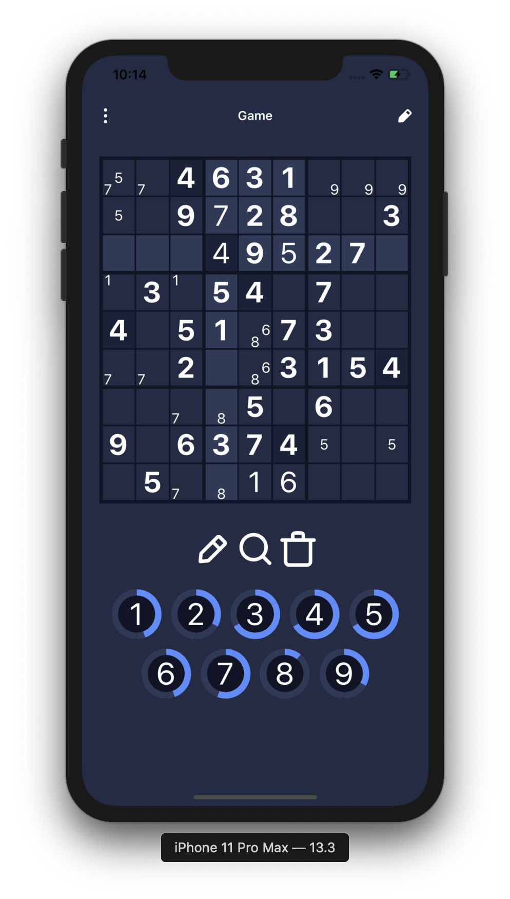

# Description

A Sudoku application for iOS and Android built with React Native using Expo.

Initialized with [expo-boilerplate](https://github.com/dawsonbooth/expo-boilerplate)

TypeScript / React Native / Expo / React Redux / React Navigation / NativeBase

# Installation

First, clone the repository with the following command:

```bash
git clone https://github.com/dawsonbooth/sudoku-halie.git
```

Next, with [Node.js](https://nodejs.org/en/download/) installed, navigate to the directory and install the necessary packages.

```bash
cd sudoku-halie
npm install
```

# Usage

Once the packages are installed, you can run the application using Expo with the following command:

```bash
npm run start
```

# Screenshots

Here are some screenshots of the iOS build.

<div float="left" align="middle">
  
  
  
  
  
  
  
  
</div>

# License

This software is released under the terms of [MIT license](LICENSE).

🎄Merry Christmas, Halie!🎁
